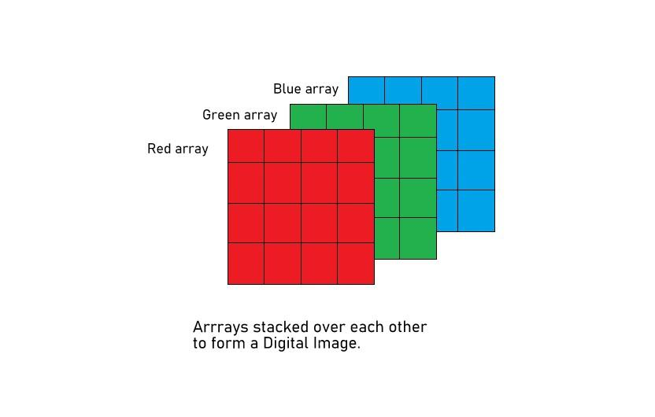

# steganography
- Install Python, Pillow and Click.
- To hide `answers1.png` in `challenge1.png`, run `python steganography.py merge --image1=challenge1.jpg --image2=solutions1.jpg --output=hidden1.jpg`
- To recover the hidden image, run `python steganography.py unmerge --image=hidden1.png --output=recovered_solutions1.jpg`

**N.B.!** You will need to write the functions `_unmerge_rgb` and `unmerge` in `steganography.py` to extract the hidden image.

# PIL
PIL (Python Imaging Library) is a library that adds image processing capabilities to your Python interpreter. This library supports many file formats, and provides powerful image processing and graphics capabilities.

An image is an array of pixels, where each pixel is an array of three values (red, green, blue). Each value is an integer between 0 and 255. The image is stored as a two-dimensional array of pixels.

```python
from PIL import Image
# Open the image file stored in the current directory
image = Image.open('./image.jpg')
# Get the array of pixels forming the image
map = image.load()
# Get the the image dimensions
height, width = image.size[0], image.size[1]
```

